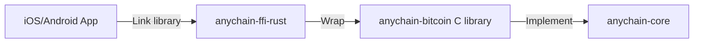

# Anychain

# Anychain

## What is Anychain?

Anychain is a multi-chain supported blockchain development framework designed to simplify interactions with various blockchains such as Ethereum, Bitcoin, Tron, and more. It provides a suite of tools and libraries that enable developers to easily create, manage, and operate blockchain addresses, transactions, and smart contracts.

## What Can Anychain Do?

- **Multi-Chain Support**: Interact with multiple blockchain platforms, allowing developers to use different blockchains within the same project.
- **Address Management**: Easily create and verify blockchain addresses.
- **Transaction Generation**: Generate and sign transactions, supporting various cryptocurrencies.
- **Smart Contract Interaction**: Interact with smart contracts, call contract methods, and handle return values.
- **Bandwidth Estimation**: Estimate the bandwidth required for transactions, helping developers optimize transaction costs.

## Who Needs Anychain?

- **Blockchain Developers**: Developers looking to quickly build applications that interact with multiple blockchains.
- **Fintech Companies**: Companies that need to integrate various cryptocurrency payment and transaction functionalities.
- **Blockchain Researchers**: Academics and researchers who want to experiment and study different blockchains.
- **Startups**: Startups aiming to leverage blockchain technology to build innovative products.

## Why Choose Anychain?

- **Ease of Use**: Anychain offers a simple and intuitive API, allowing developers to get started quickly and reducing the learning curve.
- **Flexibility**: Supports multiple blockchains, enabling developers to choose the most suitable chain based on their needs.
- **Active Community**: Anychain has an active developer community that provides support and shares best practices.
- **High Performance**: An optimized codebase ensures efficient transaction processing and low latency.

By using Anychain, developers can focus on building applications without worrying about the complexities of the underlying blockchains.

### Features

#### Common Traits when it comes to building transactions for different blockchains, they are
* PublicKey
* Address
* Amount
* Transaction
* Network
* Format

#### Common crates used in building transactions for different blockchains, they are
* base58
* secp256k1
* hex
* rand

### Functions

* Build raw unsigned transactions for different blockchains according to parameters taken from the user of this library

* Build signed transactions for different blockchains by merging the raw transaction and the corresponding signature 
  taken from the user of this library

### Architecture & Design Doc

[Design Principles for AnyChain Wallet SDK](docs/design-en.md)

### Build the source
	
    cargo build --release

## Crates

| Name                  | Description            | Crates.io                                                                            | Documentation                                                                           |
|-----------------------|------------------------|--------------------------------------------------------------------------------------|-----------------------------------------------------------------------------------------|
| [`anychain-core`]     | Core types and traits. | [][anychain-core]         | [][anychain-core-docs]         |
| [`anychain-kms`]      | BIP32、BIP39.           | [][anychain-kms]           | [][anychain-kms-docs]           |
| [`anychain-bitcoin`]  | Bitcoin impl.          | [][anychain-bitcoin]   | [][anychain-bitcoin-docs]   |
| [`anychain-ethereum`] | Ethereum impl.         | [][anychain-ethereum] | [][anychain-ethereum-docs] |
| [`anychain-filecoin`] | Filecoin impl.         | [][anychain-filecoin] | [][anychain-filecoin-docs] |
| [`anychain-tron`]     | Tron impl.             | [][anychain-tron]         | [][anychain-tron-docs]         |
| [`anychain-ripple`]   | Ripple impl.           | [][anychain-ripple]     | [][anychain-ripple-docs]     |
| [`anychain-polkadot`] | Polkadot impl.         | [][anychain-polkadot] | [][anychain-polkadot-docs] |
| [`anychain-solana`]   | Solana impl.           | [][anychain-solana]     | [][anychain-solana-docs]     |
| [`anychain-ton`]      | Ton impl.              | [][anychain-ton]           | [][anychain-solana-docs]     |

## Supported Chains
- Bitcoin
- BitcoinCash
- Dogecoin
- Litecoin
- Ethereum
- Filecoin
- Tron
- Ripple
- Arbitrum, Optimism, and Avalanche
- Polkadot
- Neo
- Solana
- Sui
- Aptos
- Sei
- Ton
 
## License

This project is licensed under the [MIT license][license].

## Contact

Feel free to join anychain sdk [Telegram](https://t.me/anychain_sdk) for discussions on code and research.

[`anychain-core`]: https://github.com/0xcregis/anychain/tree/main/anychain-core
[`anychain-kms`]: https://github.com/0xcregis/anychain/tree/main/anychain-kms
[`anychain-bitcoin`]: https://github.com/0xcregis/anychain/tree/main/anychain-bitcoin
[`anychain-ethereum`]: https://github.com/0xcregis/anychain/tree/main/anychain-ethereum
[`anychain-filecoin`]: https://github.com/0xcregis/anychain/tree/main/anychain-filecoin
[`anychain-tron`]: https://github.com/0xcregis/anychain/tree/main/anychain-tron
[`anychain-ripple`]: https://github.com/0xcregis/anychain/tree/main/anychain-ripple
[`anychain-polkadot`]: https://github.com/0xcregis/anychain/tree/main/anychain-polkadot
[`anychain-solana`]: https://github.com/0xcregis/anychain-solana
[`anychain-ton`]: https://github.com/0xcregis/anychain-ton
[anychain-core]: https://crates.io/crates/anychain-core
[anychain-kms]: https://crates.io/crates/anychain-kms
[anychain-bitcoin]: https://crates.io/crates/anychain-bitcoin
[anychain-ethereum]: https://crates.io/crates/anychain-ethereum
[anychain-filecoin]: https://crates.io/crates/anychain-filecoin
[anychain-tron]: https://crates.io/crates/anychain-tron
[anychain-ripple]: https://crates.io/crates/anychain-ripple
[anychain-polkadot]: https://crates.io/crates/anychain-polkadot
[anychain-solana]: https://crates.io/crates/anychain-solana
[anychain-ton]: https://crates.io/crates/anychain-ton
[anychain-core-docs]: https://docs.rs/anychain-core
[anychain-kms-docs]: https://docs.rs/anychain-kms
[anychain-bitcoin-docs]: https://docs.rs/anychain-bitcoin
[anychain-ethereum-docs]: https://docs.rs/anychain-ethereum
[anychain-filecoin-docs]: https://docs.rs/anychain-filecoin
[anychain-tron-docs]: https://docs.rs/anychain-tron
[anychain-ripple-docs]: https://docs.rs/anychain-ripple
[anychain-polkadot-docs]: https://docs.rs/anychain-polkadot
[anychain-solana-docs]: https://docs.rs/anychain-solana
[anychain-ton-docs]: https://docs.rs/anychain-ton
[license]: https://github.com/0xcregis/anychain/blob/main/LICENSE
